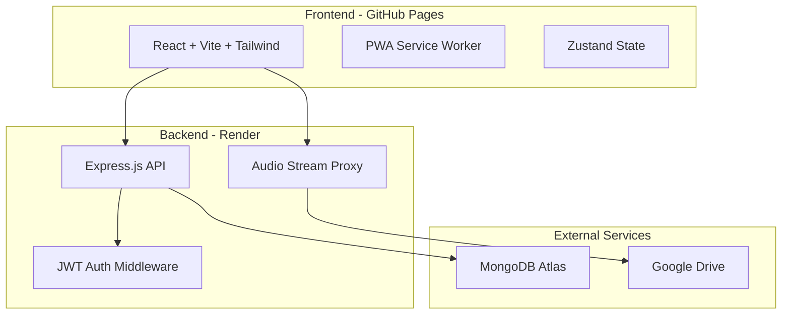

# Madhan Music — Implementation Plan

A personal cloud music streaming platform with Spotify-quality UI/UX, fully responsive across desktop, tablet, and mobile.

---

## User Review Required

> [!IMPORTANT]
> **Google Drive Streaming Strategy**: The `uc?export=download` direct link approach is **unreliable for files > 25MB** because Google forces a virus scan interstitial page. I will implement a **backend proxy** approach where the Express server fetches audio from Google Drive and streams it to the frontend. This is more reliable but means **all audio traffic flows through your Render backend**. For a personal library (~4GB), this should be within Render's free tier bandwidth limits, but may have latency. Is this acceptable, or would you prefer to use the Google Drive API with a Service Account (more setup, but more robust)?

> [!IMPORTANT]
> **Tailwind CSS Version**: The prompt specifies Tailwind CSS. I'll use **Tailwind CSS v4** with the new Vite plugin (`@tailwindcss/vite`) — no `tailwind.config.js` needed. The `@theme` block in CSS replaces config-based theming.

> [!WARNING]
> **GitHub Pages Routing**: GitHub Pages doesn't support server-side routing. I'll use `HashRouter` from React Router DOM so all routes work correctly (URLs will have `/#/` prefix). This is the standard approach for SPAs on GitHub Pages.

---

## Open Questions

> [!IMPORTANT]
> **GitHub Repository Name**: What will your GitHub repository be named? This is needed for the `base` path in `vite.config.js` for GitHub Pages deployment (e.g., `/madhan-music/`).

> [!IMPORTANT]
> **Google Drive Setup**: For the backend proxy approach, do you want:
> - **Option A (Simple)**: Use `uc?export=download` direct links with the backend proxying the request and handling redirects (works for most files under 100MB, simplest setup)
> - **Option B (Robust)**: Use Google Drive API with a Service Account (requires creating a Google Cloud project, enabling Drive API, and generating service account credentials — more setup, but handles all file sizes reliably)

---

## Architecture Overview



---

## Folder Structure

```text
madhan-music-player/
├── frontend/
│   ├── public/
│   │   ├── icons/              # PWA icons (192x192, 512x512)
│   │   ├── favicon.ico
│   │   └── robots.txt
│   ├── src/
│   │   ├── assets/             # Static images, fonts
│   │   ├── components/
│   │   │   ├── layout/         # Sidebar, BottomNav, TopHeader, RightPanel
│   │   │   ├── player/         # MusicPlayer, MiniPlayer, FullScreenPlayer
│   │   │   ├── common/         # Button, Card, Modal, Drawer, Input, Avatar
│   │   │   ├── song/           # SongCard, SongRow, SongGrid
│   │   │   ├── playlist/       # PlaylistCard, PlaylistForm
│   │   │   └── charts/         # AnalyticsCharts (Recharts wrappers)
│   │   ├── hooks/              # useMediaQuery, useAudio, useDebounce, useSwipe
│   │   ├── pages/
│   │   │   ├── Home.jsx
│   │   │   ├── Library.jsx
│   │   │   ├── Search.jsx
│   │   │   ├── Favorites.jsx
│   │   │   ├── Playlist.jsx
│   │   │   ├── Analytics.jsx
│   │   │   ├── Profile.jsx
│   │   │   ├── Settings.jsx
│   │   │   ├── Admin.jsx        # Admin song management page
│   │   │   ├── Login.jsx
│   │   │   └── Register.jsx
│   │   ├── store/
│   │   │   ├── usePlayerStore.js
│   │   │   ├── useAuthStore.js
│   │   │   ├── useLibraryStore.js
│   │   │   └── useUIStore.js
│   │   ├── services/
│   │   │   ├── api.js           # Axios instance
│   │   │   ├── authService.js
│   │   │   ├── songService.js
│   │   │   ├── playlistService.js
│   │   │   └── analyticsService.js
│   │   ├── utils/
│   │   │   ├── driveUtils.js    # extractFileId, validateLink, generateStreamUrl
│   │   │   ├── formatters.js    # Duration, date formatters
│   │   │   └── constants.js
│   │   ├── App.jsx
│   │   ├── main.jsx
│   │   └── index.css            # Tailwind + custom theme
│   ├── index.html
│   ├── vite.config.js
│   └── package.json
│
├── backend/
│   ├── src/
│   │   ├── config/
│   │   │   └── db.js            # MongoDB connection
│   │   ├── middleware/
│   │   │   ├── auth.js          # JWT verification
│   │   │   ├── rateLimiter.js
│   │   │   └── validation.js
│   │   ├── models/
│   │   │   ├── User.js
│   │   │   ├── Song.js
│   │   │   ├── Playlist.js
│   │   │   ├── ListeningHistory.js
│   │   │   └── Favorite.js
│   │   ├── routes/
│   │   │   ├── auth.js
│   │   │   ├── songs.js
│   │   │   ├── playlists.js
│   │   │   ├── favorites.js
│   │   │   ├── analytics.js
│   │   │   ├── stream.js       # Audio proxy endpoint
│   │   │   └── search.js
│   │   ├── controllers/
│   │   │   ├── authController.js
│   │   │   ├── songController.js
│   │   │   ├── playlistController.js
│   │   │   ├── favoriteController.js
│   │   │   ├── analyticsController.js
│   │   │   ├── streamController.js
│   │   │   └── searchController.js
│   │   └── utils/
│   │       ├── driveUtils.js
│   │       └── helpers.js
│   ├── server.js
│   ├── package.json
│   └── .env.example
│
├── README.md
└── DEPLOYMENT.md
```

---

## Proposed Changes

### Phase 1: Project Scaffolding & Configuration

#### [NEW] Frontend Vite Project

Initialize React + Vite project with all dependencies:

**Core**: `react`, `react-dom`, `react-router-dom`
**State**: `zustand`
**Data Fetching**: `@tanstack/react-query`, `axios`
**Styling**: `tailwindcss`, `@tailwindcss/vite`
**Animation**: `framer-motion`
**Charts**: `recharts`
**Icons**: `lucide-react`
**PWA**: `vite-plugin-pwa`
**Deploy**: `gh-pages`

#### [NEW] Backend Express Project

Initialize Node.js/Express project with dependencies:

**Core**: `express`, `cors`, `dotenv`, `helmet`
**Database**: `mongoose`
**Auth**: `jsonwebtoken`, `bcryptjs`
**Security**: `express-rate-limit`, `express-validator`
**Streaming**: `node-fetch` (or native fetch for proxying Drive files)

#### [NEW] Configuration Files

- `vite.config.js` — Tailwind v4 plugin, PWA plugin, base path for GitHub Pages
- `index.css` — Tailwind import + custom `@theme` with Madhan Music color palette
- `.env.example` files for both frontend and backend

---

### Phase 2: Backend API

#### [NEW] MongoDB Models

| Model | Key Fields |
|-------|-----------|
| **User** | name, email, passwordHash, avatar, createdAt |
| **Song** | title, artist, album, genre, duration, coverImage, driveFileId, streamUrl, addedBy, createdAt |
| **Playlist** | name, description, coverImage, songs[], owner, createdAt |
| **Favorite** | userId, songId, createdAt |
| **ListeningHistory** | userId, songId, playedAt, duration, completedPercentage |

#### [NEW] API Routes

| Method | Route | Description |
|--------|-------|-------------|
| POST | `/api/auth/register` | Register new user |
| POST | `/api/auth/login` | Login, return JWT |
| GET | `/api/auth/me` | Get current user |
| PUT | `/api/auth/profile` | Update profile |
| PUT | `/api/auth/password` | Change password |
| GET | `/api/songs` | List songs (paginated, filterable) |
| POST | `/api/songs` | Add song (admin) |
| POST | `/api/songs/bulk` | Bulk add songs (admin) |
| PUT | `/api/songs/:id` | Update song |
| DELETE | `/api/songs/:id` | Delete song |
| GET | `/api/stream/:fileId` | **Proxy stream from Google Drive** |
| GET | `/api/playlists` | List user's playlists |
| POST | `/api/playlists` | Create playlist |
| PUT | `/api/playlists/:id` | Update playlist (add/remove/reorder songs) |
| DELETE | `/api/playlists/:id` | Delete playlist |
| GET | `/api/favorites` | Get user's favorites |
| POST | `/api/favorites/:songId` | Toggle favorite |
| GET | `/api/search?q=` | Search songs, artists, albums |
| POST | `/api/history` | Log listening event |
| GET | `/api/analytics` | Get user analytics |
| GET | `/api/analytics/recommendations` | Get recommendations |

#### [NEW] Audio Stream Proxy (`streamController.js`)

The stream endpoint will:
1. Receive a `driveFileId`
2. Construct the Google Drive download URL
3. Fetch the file from Google Drive server-side (following redirects)
4. Set correct `Content-Type: audio/mpeg` headers
5. Support HTTP Range requests for seeking
6. Pipe the stream to the client

---

### Phase 3: Authentication System

#### [NEW] [Login.jsx](file:///c:/Users/Madhan/Desktop/madhan%20music%20player/frontend/src/pages/Login.jsx)
- Glassmorphic login card with email/password fields
- "Remember Me" checkbox
- Animated background with gradient mesh
- Link to register page

#### [NEW] [Register.jsx](file:///c:/Users/Madhan/Desktop/madhan%20music%20player/frontend/src/pages/Register.jsx)
- Registration form with name, email, password, avatar upload
- Password strength indicator
- Animated transitions

#### [NEW] [useAuthStore.js](file:///c:/Users/Madhan/Desktop/madhan%20music%20player/frontend/src/store/useAuthStore.js)
- JWT token management (localStorage)
- User state persistence
- Auto-login on app load
- Logout with state cleanup

---

### Phase 4: Layout System & Responsive Design

#### [NEW] Desktop Layout (`≥1024px`)
```text
┌──────────┬──────────────────────┬────────────┐
│          │                      │            │
│ Sidebar  │    Main Content      │ Right Panel│
│          │                      │ (Queue/    │
│ • Home   │                      │  Now       │
│ • Search │                      │  Playing)  │
│ • Library│                      │            │
│ • Lists  │                      │            │
│ • Favs   │                      │            │
│ • Stats  │                      │            │
│ • Admin  │                      │            │
│ • Config │                      │            │
│          │                      │            │
├──────────┴──────────────────────┴────────────┤
│              Music Player Bar                │
└──────────────────────────────────────────────┘
```

#### [NEW] Tablet Layout (`768px - 1024px`)
- Collapsible sidebar (hamburger toggle)
- No right panel — queue opens as slide-in drawer
- Full-width content area
- Bottom player bar

#### [NEW] Mobile Layout (`< 768px`)
```text
┌──────────────────────────────────┐
│         Top Header               │
├──────────────────────────────────┤
│                                  │
│         Main Content             │
│         (Scrollable)             │
│                                  │
├──────────────────────────────────┤
│         Mini Player              │
├──────────────────────────────────┤
│  Home  Search  Library  Favs  Me │
└──────────────────────────────────┘
```

**Key Layout Components:**
- `AppLayout.jsx` — Main responsive layout wrapper
- `Sidebar.jsx` — Desktop/tablet sidebar with glassmorphism
- `BottomNav.jsx` — Mobile bottom navigation (Spotify-style)
- `TopHeader.jsx` — Mobile header
- `RightPanel.jsx` — Desktop queue/now-playing panel
- `QueueDrawer.jsx` — Tablet/mobile queue drawer

---

### Phase 5: Music Player System

#### [NEW] Player Components

| Component | Description |
|-----------|-------------|
| `MusicPlayer.jsx` | Desktop bottom bar — album art, song info, controls, seek bar, volume |
| `MiniPlayer.jsx` | Mobile mini player — tappable, shows song info + play/pause |
| `FullScreenPlayer.jsx` | Mobile full-screen — large cover art, all controls, swipe-down to close |

#### [NEW] [usePlayerStore.js](file:///c:/Users/Madhan/Desktop/madhan%20music%20player/frontend/src/store/usePlayerStore.js)

State management for the audio player:
- `currentSong`, `queue`, `isPlaying`, `volume`, `progress`, `duration`
- `shuffle`, `repeat` (none/one/all), `playbackSpeed`
- Actions: `play()`, `pause()`, `next()`, `previous()`, `seekTo()`, `setVolume()`
- Queue management: `addToQueue()`, `removeFromQueue()`, `reorderQueue()`
- HTML5 Audio API integration via a singleton `Audio` instance

#### [NEW] `useAudio.js` Hook
- Wraps `HTMLAudioElement`
- Handles `timeupdate`, `ended`, `loadedmetadata` events
- Implements seek, volume, playback speed
- Logs listening history to backend

---

### Phase 6: Core Pages

#### [NEW] [Home.jsx](file:///c:/Users/Madhan/Desktop/madhan%20music%20player/frontend/src/pages/Home.jsx)
- Welcome hero section with user greeting, avatar, stats
- "Recently Played" horizontal scroll
- "Continue Listening" section
- "Recommended For You" section (based on listening history)
- "Quick Access" — Favorites, Top Artists, Recent Playlists
- Animated cards with Framer Motion stagger

#### [NEW] [Library.jsx](file:///c:/Users/Madhan/Desktop/madhan%20music%20player/frontend/src/pages/Library.jsx)
- Search bar with instant filtering
- Filter chips: Artist, Album, Genre, Favorites
- Sort dropdown: Name, Date Added, Duration
- Toggle: Grid View / List View
- Infinite scroll with React Query
- Song cards with hover effects

#### [NEW] [Search.jsx](file:///c:/Users/Madhan/Desktop/madhan%20music%20player/frontend/src/pages/Search.jsx)
- Full-screen search with debounced input
- Categorized results: Songs, Artists, Albums, Playlists
- Recent searches (localStorage)
- Search suggestions

#### [NEW] [Playlist.jsx](file:///c:/Users/Madhan/Desktop/madhan%20music%20player/frontend/src/pages/Playlist.jsx)
- Playlist detail view with cover, song count, total duration
- Song list with drag-to-reorder
- Add/remove songs
- Edit playlist metadata

#### [NEW] [Favorites.jsx](file:///c:/Users/Madhan/Desktop/madhan%20music%20player/frontend/src/pages/Favorites.jsx)
- Favorite songs grid/list
- Favorite artists section

#### [NEW] [Analytics.jsx](file:///c:/Users/Madhan/Desktop/madhan%20music%20player/frontend/src/pages/Analytics.jsx)
- Stats cards: Total Listening Hours, Most Played Song, Favorite Artist, Favorite Genre
- Charts (Recharts): Daily activity, weekly activity, genre distribution pie chart, artist distribution bar chart
- Songs played today counter

#### [NEW] [Profile.jsx](file:///c:/Users/Madhan/Desktop/madhan%20music%20player/frontend/src/pages/Profile.jsx)
- Avatar, name, email, join date
- Total songs, listening hours
- Edit profile form

#### [NEW] [Settings.jsx](file:///c:/Users/Madhan/Desktop/madhan%20music%20player/frontend/src/pages/Settings.jsx)
- Theme toggle (dark/light)
- Change password
- Export data (JSON)
- Backup metadata

---

### Phase 7: Admin Song Management

#### [NEW] [Admin.jsx](file:///c:/Users/Madhan/Desktop/madhan%20music%20player/frontend/src/pages/Admin.jsx)

Instead of pasting Drive links one by one, this admin page provides:

1. **Single Song Add** — Form with title, artist, album, genre, Drive link, cover image
2. **Bulk Import** — Paste multiple Google Drive links, auto-detect file names, batch-edit metadata
3. **CSV Import** — Upload a CSV file with song metadata + Drive links
4. **Song Manager Table** — Sortable, searchable table of all songs with inline edit and delete
5. **Auto-extract** — Automatically extracts Drive File ID and generates stream URL from pasted link
6. **Validation** — Validates Drive links are accessible before saving

---

### Phase 8: PWA & Deployment

#### [NEW] PWA Configuration
- `vite-plugin-pwa` with `registerType: 'autoUpdate'`
- Web App Manifest (name, icons, theme color, background color, display: standalone)
- Service worker with Workbox caching strategies:
  - Cache-first for static assets (JS, CSS, images)
  - Network-first for API calls
- Install prompt banner: "Install Madhan Music"
- Offline fallback page

#### [NEW] Deployment Configs
- Frontend `package.json`: `predeploy` + `deploy` scripts for `gh-pages`
- Backend: `Procfile` or `render.yaml` for Render deployment
- Environment variable documentation

---

## Verification Plan

### Automated Checks
- `npm run build` — Ensure frontend builds without errors
- Backend `node server.js` — Ensure server starts
- Lint check with ESLint

### Manual Verification
1. **Desktop**: Verify 3-column layout, sidebar navigation, right panel queue, bottom player
2. **Tablet** (resize browser to 768-1024px): Verify collapsible sidebar, no right panel, drawer queue
3. **Mobile** (resize browser to <768px): Verify bottom nav, mini player, full-screen player, swipe gestures
4. **Player**: Test play/pause, next/previous, seek, volume, shuffle, repeat
5. **Auth**: Test register, login, logout, session persistence
6. **Admin**: Test single song add, bulk import, CSV import
7. **PWA**: Test install prompt, offline behavior
8. **Analytics**: Verify charts render with mock data

### Deployment Testing
- Frontend deploys to GitHub Pages
- Backend deploys to Render
- MongoDB Atlas connection works
- Audio streaming works via proxy
